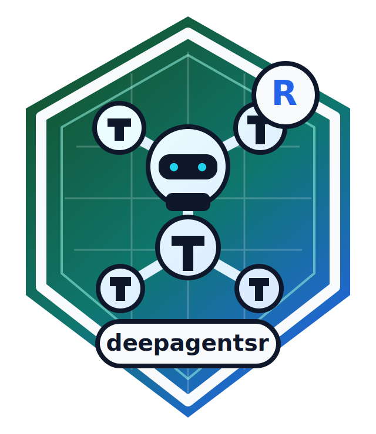

# deepagentsr



`deepagentsr` is an R-native agent harness inspired by Deep Agents. It
provides a high-level
[`create_deep_agent()`](https://hadimaster65555.github.io/deepagentsr/reference/create_deep_agent.md)
API with R tools, a virtual filesystem, planning tools, subagents,
skills, memory, human approval, permissions, context offloading, and
event traces.

The package is designed to use `ellmer` chat objects for real LLM calls,
while the included fake chat model makes tests and examples
deterministic.

``` r

library(deepagentsr)

search_tool <- deep_tool(
  function(query) paste("mock result for", query),
  name = "internet_search",
  description = "Search a mocked index.",
  side_effects = "read"
)

agent <- create_deep_agent(
  model = fake_chat(list(
    assistant_tool_call("write_todos", list(items = list("Search", "Summarize"))),
    assistant_tool_call("internet_search", list(query = "ellmer R package")),
    assistant_message("ellmer is useful because it provides chat and tool-calling abstractions for R.")
  )),
  tools = list(search_tool),
  backend = memory_backend()
)

result <- agent$invoke("Research ellmer.")
result$text
```

``` R
## [1] "ellmer is useful because it provides chat and tool-calling abstractions for R."
```

## Safety posture

The default backend is in memory. Local filesystem access is an explicit
capability grant through `filesystem_backend(root_dir)`, which maps
virtual paths into a configured root and blocks traversal and common
secret-like paths. Shell execution is not included in the default
runtime.

## Optional integrations

`ellmer` is the intended model and tool-calling substrate. MCP, RAG,
Shiny chat, and `aisdk` interop are optional helpers so the core package
stays small while extension points remain available. The guarded live
test path exercises OpenAI tool-calling across GPT 4.1 and GPT 5 family
models when credentials and model access are available.
